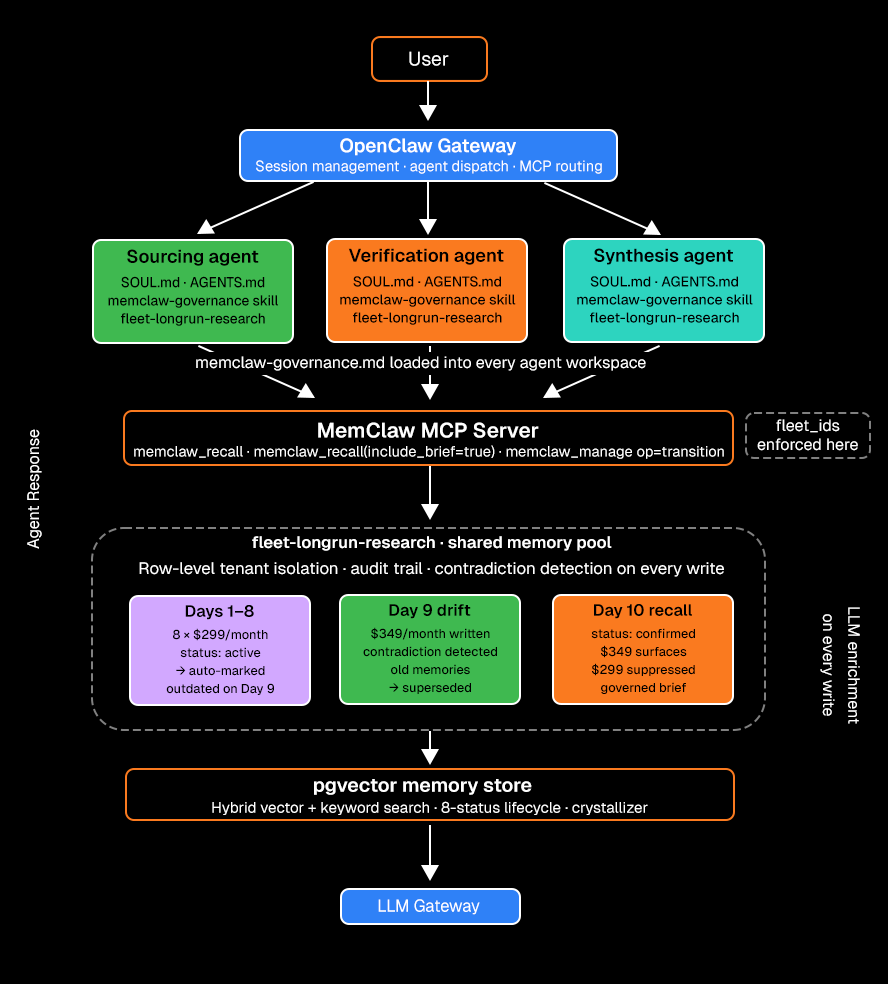

<div align="center">
  <a href="https://memclaw.net">
    
  </a>

  <br/>
  <br/>

  <p>
    <a href="https://github.com/caura-ai/caura-memclaw/blob/main/LICENSE">
      
    </a>
    &nbsp;
    <a href="https://memclaw.net/docs">
      
    </a>
    &nbsp;
    <a href="https://memclaw.net/pricing">
      
    </a>
    &nbsp;
    <a href="https://github.com/caura-ai/caura-memclaw">
      
    </a>
    &nbsp;
    <a href="https://docs.openclaw.ai">
      
    </a>
    &nbsp;
    <a href="https://docs.openclaw.ai">
      
    </a>
    &nbsp;
    <a href="simulate.py">
      
    </a>
    &nbsp;
    <a href="https://nodejs.org">
      
    </a>
  </p>

  <h3>Three agents. One memory pool. Zero stale context.</h3>

  <p>
    A reference implementation showing how MemClaw manages shared memory
    across a continuously running agent fleet over 14 simulated days,
    with automatic contradiction resolution and governed recall.
  </p>

  <p>
    <a href="#what-is-openclaw"><b>OpenClaw</b></a> &nbsp;·&nbsp;
    <a href="#what-is-memclaw"><b>MemClaw</b></a> &nbsp;·&nbsp;
    <a href="#the-problem"><b>The Problem</b></a> &nbsp;·&nbsp;
    <a href="#why-a-multi-agent-architecture"><b>Why Multi-Agent</b></a> &nbsp;·&nbsp;
    <a href="#how-it-works"><b>How It Works</b></a> &nbsp;·&nbsp;
    <a href="#architecture"><b>Architecture</b></a> &nbsp;·&nbsp;
    <a href="#create-a-fleet"><b>Create a Fleet</b></a> &nbsp;·&nbsp;
    <a href="#quickstart"><b>Quickstart</b></a> &nbsp;·&nbsp;
    <a href="#run-the-simulation"><b>Run the Simulation</b></a> &nbsp;·&nbsp;
    <a href="#observing-the-fleet"><b>Observing the Fleet</b></a>
  </p>
</div>

<br/>

---

## Demo


<br/>

---


## What is MemClaw

[MemClaw](https://github.com/caura-ai/caura-memclaw) is open-source multi-agent memory for AI agent fleets: governed, shared, and self-improving. Agents write plain text. MemClaw turns it into searchable, governed, structured memory with automatic enrichment, lifecycle management, and cross-agent knowledge sharing.

**The core loop: write, recall, compound.** Every interaction makes the next one smarter.

What makes MemClaw different from a vector database:

| Capability                  | What it means                                                                                                                                                                                                             |
| --------------------------- | ------------------------------------------------------------------------------------------------------------------------------------------------------------------------------------------------------------------------- |
| **Fleet isolation**         | Memory partitioned by `fleet_id`. Every recall passes a `WHERE fleet_id IN (...)` predicate before the search runs. Boundaries are a query-layer contract, not prompt instructions.                                       |
| **LLM enrichment on write** | Every `memclaw_write` auto-classifies type, generates title/summary/tags, scans PII, extracts entities, detects contradictions from a single `content` field                                                              |
| **Hybrid recall**           | `memclaw_recall` combines vector similarity, keyword search, and knowledge graph traversal in one call                                                                                                                    |
| **8-status lifecycle**      | Memories move through `active`, `pending`, `confirmed`, `cancelled`, `outdated`, `conflicted`, `archived`, `deleted` statuses automatically; supersession is tracked via `supersedes_id` FK (`memclaw_manage op=lineage`) |
| **Crystallizer**            | LLM batch process that merges near-duplicate memories into canonical atomic facts with full provenance                                                                                                                    |
| **Audit trail**             | Every read and write logged. "Which agent recalled this memory and when" is always answerable                                                                                                                             |
| **Karpathy Loop**           | Agents report outcomes via `memclaw_evolve`; the system reinforces what works and generates preventive rules on failure                                                                                                   |                                                                                                            |

<p align="center">
  <a href="https://github.com/caura-ai/caura-memclaw"><strong>MemClaw source (Apache 2.0)</strong></a> ·
  <a href="https://memclaw.net/docs"><strong>Documentation</strong></a> ·
  <a href="https://memclaw.net"><strong>Managed cloud (free tier available)</strong></a>
</p>

<br/>

> **Do you need a MemClaw API key?** No. For the local Docker deploy, `MEMCLAW_API_KEY` stays blank. You only need a key if you use the managed cloud service at [memclaw.net](https://memclaw.net).


---
## What is OpenClaw

OpenClaw is an open-source agent gateway. It runs locally, registers named agents from workspace directories, and exposes them through a unified chat interface and API.

| File        | Role                                                                                    |
| :---------- | :-------------------------------------------------------------------------------------- |
| `SOUL.md`   | Injected as the system prompt. Defines who the agent is and its behavioral constraints. |
| `AGENTS.md` | Injected second. Defines the daily workflow, tool call rules, and fleet scope.          |
| `skills/`   | Shared governance files loaded into every agent on every session.                       |

In this repo, OpenClaw routes prompts to each agent, injects their context files, and connects the MemClaw MCP server so agents call `memclaw_*` tools natively.

```bash
npm install -g openclaw@latest
```

[OpenClaw documentation](https://docs.openclaw.ai)

<br/>

---

## The Problem

Standard vector databases accumulate contradictions silently.

When your agent fleet runs every day, a fact that changes in the real world gets added _alongside_ the old version, not instead of it. By Day 9, the memory pool has 8 entries saying `$299` and 1 entry saying `$349`, and nothing tells your synthesis agent which one is current. Outputs become inconsistent, and the only fix is manual cleanup that does not scale.

| Approach                   | What breaks                                                                               |
| :------------------------- | :---------------------------------------------------------------------------------------- |
| **Raw vector store**       | Old and new facts coexist with no resolution mechanism. Both get recalled.                |
| **Prompt-level filtering** | Telling the agent to "ignore old data" does not remove stale vectors from recall results. |
| **Manual cleanup**         | Someone has to delete the stale entries by hand. Does not scale past a week.              |

**MemClaw resolves this automatically.** When the Sourcing Agent writes `$349/month` on Day 9, MemClaw queues an async contradiction detection pass. Once that pass completes, it marks all eight `$299` entries `outdated`. `simulate.py` polls `GET /memories/{memory_id}/contradictions` until `detection_status` is `completed` before Synthesis queries the pool, ensuring the recall surface is clean. (The crystallizer is a separate, unrelated background job that only dedups near-identical memories into a canonical fact — it never sets `outdated`.)

<br/>

---

## Why a Multi-Agent Architecture

A single agent doing everything (scrape, verify, summarise) compounds errors silently. One agent that both writes and reads its own output has no external check on what it recalls. If it hallucinates a fact or misreads a source, that error gets written to memory and recalled as truth on every subsequent day.

Splitting into three agents with distinct roles creates **separation of concerns at the memory layer**:

| Single-agent approach | Three-agent approach |
| :-------------------- | :------------------- |
| Writes and reads its own output, no external check | Sourcing writes; Verification reads and confirms independently |
| One context window holds scraping logic, verification logic, and synthesis logic, all three compete for attention | Each agent has a focused SOUL.md and AGENTS.md, no context pollution |
| A bad write poisons the agent's own next recall | A bad write is caught by Verification before it reaches Synthesis |
| Can't audit which agent wrote which memory | Every write carries `agent_id`, the audit trail is per-role, not per-run |
| Parallelism requires threads within one agent, complex and brittle | Sourcing and Verification run as independent agents in parallel, clean by design |

**The key insight:** shared memory only becomes reliable when the agents that write it are distinct from the agents that validate it. MemClaw's fleet isolation enforces this: each agent declares its `agent_id` on every write, and the verification agent reads with `filter_agent_id: "sourcing-agent"` so it only checks what sourcing produced.

This is the pattern that scales. A single agent that does everything hits a wall at week two when its memory pool is large, its context is full, and there is no way to know which recalled fact was actually verified and which was a self-reinforced guess.

<br/>

---

## How It Works

Three OpenClaw agents share one MemClaw fleet and run every day for 14 simulated days.

**The scenario:** A competitor pricing page shows `$299/month` for Days 1-8. On Day 9, the price changes to `$349/month`. The Sourcing Agent scrapes the new number, creating a direct conflict with eight reinforced memories from the prior week.

| Day          | What happens                                                                                                                                                                                                                                   |
| :----------- | :--------------------------------------------------------------------------------------------------------------------------------------------------------------------------------------------------------------------------------------------- |
| **Days 1-8** | Sourcing and Verification run in parallel. MemClaw auto-enriches every write with a title, tags, and entity list. Neither agent sends structured data.                                                                                         |
| **Day 9**    | Sourcing writes `$349`. MemClaw queues async contradiction detection and marks all eight `$299` memories `outdated` once detection completes. `simulate.py` polls the contradiction-detection status for that write before letting Synthesis run. |
| **Day 10**   | Synthesis calls `memclaw_recall`. One result comes back: `$349`. The eight `$299` memories are suppressed by status, not by a prompt instruction. The brief reports exactly how many were filtered.                                            |

<br/>

---

## Architecture

<div align="center">
  
</div>

<br/>

---

## Repository Structure

```
memclaw-longrun-fleet/
├── simulate.py                     # 14-day simulation runner
├── openclaw.json                   # Gateway config: model, agents, MCP server
├── .env.example
├── agents/
│   ├── sourcing-agent/
│   │   ├── SOUL.md                 # Agent identity and behavioral constraints
│   │   └── AGENTS.md               # Daily workflow and tool call rules
│   ├── verification-agent/
│   │   ├── SOUL.md
│   │   └── AGENTS.md
│   └── synthesis-agent/
│       ├── SOUL.md
│       └── AGENTS.md
└── skills/
    └── memclaw-research-fleet.md   # Shared governance skill for all agents
```

`memclaw-research-fleet.md` is copied into every agent workspace. Update it once to update all three agents.

<br/>

---

## Agent Roles

| Agent                | Role                             | Writes                             | Reads                              |
| :------------------- | :------------------------------- | :--------------------------------- | :--------------------------------- |
| `sourcing-agent`     | Scrapes competitor pricing daily | Pricing facts                      | Active fleet brief                 |
| `verification-agent` | Cross-checks sourced facts       | Verification notes, conflict flags | All sourcing-agent memories        |
| `synthesis-agent`    | Produces the daily brief         | Brief outcome metadata             | Active and confirmed memories only |

All three share one fleet (`fleet-longrun-research`) and one governance skill. The skill defines the `tenant_id`, `fleet_id`, and `agent_id` values every agent must include in every tool call.

### Memory visibility

| Visibility value | What it means                                                                                                                                             |
| :--------------- | :-------------------------------------------------------------------------------------------------------------------------------------------------------- |
| `scope_team`     | Readable by any agent in the same fleet. Default in this repo.                                                                                            |
| `scope_agent`    | Per-row server-side ACL. Only the writing agent can read it back. Use this for agent-private scratchpad state that should never surface to other agents. |

This repo uses `scope_team` so all three agents share the same memory pool. For hard per-agent isolation, set `visibility: "scope_agent"` at write time.

<br/>

---

## MCP Tools Used

| Tool                                     | What it does                                                               |
| :--------------------------------------- | :------------------------------------------------------------------------- |
| `memclaw_write`                          | Write a fact to the fleet with auto-enrichment and contradiction detection |
| `memclaw_recall`                         | Search the pool by query, filtered by status or agent                      |
| `memclaw_recall` (`include_brief: true`) | Governed recall shortcut. Default recall already excludes `outdated`/`conflicted`/`archived`/`deleted` rows while keeping `confirmed` ones — don't pass `status: "active"` explicitly, since that also excludes `confirmed` memories. |
| `memclaw_manage` (`op: "transition"`)    | Move a memory between statuses (e.g. `active` to `confirmed`)              |

<br/>

---

## Prerequisites

| Requirement     | Notes                                                                     |
| :-------------- | :------------------------------------------------------------------------ |
| Node.js 18+     | Required for OpenClaw CLI                                                 |
| Python 3.9+     | Required for `simulate.py`                                                |
| OpenClaw CLI    | `npm install -g openclaw@latest`                                          |
| MemClaw account | [Free tier at memclaw.net](https://memclaw.net) or self-hosted via Docker |
| LLM API key     | Any OpenAI-compatible endpoint (DeepSeek-v3, Ollama, etc.)                |

<br/>

---

## Create a Fleet

A MemClaw fleet is the shared memory partition all three agents write to and read from. Create it once before running the simulation.

**Managed cloud (memclaw.net):**

```bash
curl -X POST "https://memclaw.net/api/v1/fleet" \
  -H "X-API-Key: $MEMCLAW_API_KEY" \
  -H "Content-Type: application/json" \
  -d "{
    \"tenant_id\": \"$MEMCLAW_TENANT_ID\",
    \"fleet_id\": \"fleet-longrun-research\",
    \"display_name\": \"Long-Run Research Fleet\"
  }"
```

**Self-hosted (Docker):**

```bash
# Clone and start caura-memclaw (do this outside this repo's directory)
git clone https://github.com/caura-ai/caura-memclaw.git
cd caura-memclaw && docker compose up -d

# Then create the fleet (no API key needed)
curl -X POST "http://localhost:8000/api/v1/fleet" \
  -H "Content-Type: application/json" \
  -d '{
    "tenant_id": "local",
    "fleet_id": "fleet-longrun-research",
    "display_name": "Long-Run Research Fleet"
  }'
```

A successful response returns the fleet object with its `fleet_id`. If you see a `FORBIDDEN` error, your `tenant_id` doesn't match the one bound to your API key, use the tenant ID shown in your memclaw.net dashboard.

<br/>

---

## Quickstart

### 1. Clone the repo

```bash
git clone https://github.com/Infrasity-Labs/memclaw-long-run-fleet.git
cd memclaw-long-run-fleet
```

### 2. Copy the gateway config

```bash
cp openclaw.json ~/.openclaw/openclaw.json
```

> [!NOTE]
> OpenClaw reads its config from `~/.openclaw/openclaw.json`, not the repo root. Copy it once, then edit the copy with your real LLM endpoint URL and key. On Windows: `copy openclaw.json "%USERPROFILE%\.openclaw\openclaw.json"`

### 3. Set up environment variables

```bash
cp .env.example .env
```

Open `.env` and fill in your keys:

```bash
# LLM gateway
LLM_GATEWAY_API_KEY=your_llm_key_here

# MemClaw
MEMCLAW_API_KEY=mc_your_key_here
MEMCLAW_TENANT_ID=your_tenant_id_here
MEMCLAW_FLEET_ID=fleet-longrun-research

# These defaults work without changes
OPENCLAW_GATEWAY_URL=http://127.0.0.1:18789
MEMCLAW_API_URL=https://memclaw.net/api/v1
```

> [!NOTE]
> **Self-hosted MemClaw:** Clone [caura-memclaw](https://github.com/caura-ai/caura-memclaw) and run `docker compose up -d`. Do not use a standalone `docker run` command, as MemClaw requires multiple services. Once running, set `MEMCLAW_API_URL=http://localhost:8000/api/v1` and leave `MEMCLAW_API_KEY` blank.

> [!NOTE]
> **Fully local LLM via Ollama:** Edit `openclaw.json` and point the `providers` block at `http://localhost:11434/v1` with `"api_key": "ollama"` and your chosen model name.

> [!WARNING]
> **`openclaw.json` also needs updating.** The `providers.llm-gateway.base_url` in `openclaw.json` is a placeholder (`https://your-llm-gateway/v1`). Replace it with your actual LLM endpoint URL and set `LLM_GATEWAY_API_KEY` in `.env`. Without this, every agent call will fail with a connection error.

### 4. Create the MemClaw fleet

See the [Create a Fleet](#create-a-fleet) section above for the full command. Quick version:

```bash
curl -X POST "https://memclaw.net/api/v1/fleet" \
  -H "X-API-Key: $MEMCLAW_API_KEY" \
  -H "Content-Type: application/json" \
  -d "{\"tenant_id\": \"$MEMCLAW_TENANT_ID\", \"fleet_id\": \"fleet-longrun-research\", \"display_name\": \"Long-Run Research Fleet\"}"
```

### 5. Install the MemClaw plugin

> [!WARNING]
> The installer script configures the MemClaw MCP server in your OpenClaw workspace. Review it at `https://memclaw.net/api/v1/install-plugin` before running.

```bash
curl -sf "https://memclaw.net/api/v1/install-plugin?fleet_id=fleet-longrun-research" \
  -H "X-API-Key: $MEMCLAW_API_KEY" | bash
```

> [!NOTE]
> **Windows users:** The `| bash` pipe may fail in Git Bash due to a `hostname -s` incompatibility. Skip this step. The repo's `openclaw.json` already includes the MemClaw MCP server config. Proceed directly to step 6.

### 6. Deploy agent workspaces

```bash
REPO=$(pwd)

cp -r "$REPO/agents/sourcing-agent"     ~/.openclaw/workspace-sourcing-agent
cp -r "$REPO/agents/verification-agent" ~/.openclaw/workspace-verification-agent
cp -r "$REPO/agents/synthesis-agent"    ~/.openclaw/workspace-synthesis-agent

for agent in sourcing-agent verification-agent synthesis-agent; do
  mkdir -p ~/.openclaw/workspace-$agent/skills
  cp "$REPO/skills/memclaw-research-fleet.md" ~/.openclaw/workspace-$agent/skills/
done
```

### 7. Register the agents

```bash
openclaw agents add sourcing-agent     --workspace ~/.openclaw/workspace-sourcing-agent     --non-interactive
openclaw agents add verification-agent --workspace ~/.openclaw/workspace-verification-agent --non-interactive
openclaw agents add synthesis-agent    --workspace ~/.openclaw/workspace-synthesis-agent    --non-interactive
```

> [!NOTE]
> **Windows users:** Use absolute paths to avoid a path-doubling bug. Replace `~/.openclaw` with your full home directory path, e.g.:
>
> ```powershell
> openclaw agents add sourcing-agent --workspace "C:\Users\<you>\.openclaw\workspace-sourcing-agent" --non-interactive
> openclaw agents add verification-agent --workspace "C:\Users\<you>\.openclaw\workspace-verification-agent" --non-interactive
> openclaw agents add synthesis-agent --workspace "C:\Users\<you>\.openclaw\workspace-synthesis-agent" --non-interactive
> ```

### 8. Start the gateway

```bash
openclaw gateway start   # use "restart" if the gateway is already running
openclaw agents list     # verify all three agents appear
openclaw dashboard       # http://127.0.0.1:18789
```

### 9. Verify MemClaw is connected

```bash
openclaw doctor
# Expected: [memclaw] ContextEngine 'memclaw' registered
```

<br/>

---

## Run the Simulation

```bash
pip install -r requirements.txt
python simulate.py
```

What happens each simulated day:

1. Sourcing Agent and Verification Agent start in parallel threads
2. Both complete before the next step runs
3. On Day 9 only: `simulate.py` polls `GET /memories/{memory_id}/contradictions` until the async contradiction detector finishes, before Synthesis runs
4. Synthesis Agent runs and produces the governed daily brief

Optional flags:

```bash
python simulate.py --dry-run            # print all prompts without calling the gateway
python simulate.py --start 9 --end 10  # resume from a specific day
python simulate.py --days 1 9 10       # run specific days only
python simulate.py --delay 0           # no pause between days
```

<br/>

---

## Observing the Fleet

The three moments that demonstrate MemClaw's behavior. Run them manually in the OpenClaw dashboard, or let `simulate.py` drive them automatically.

<br/>

### Day 1: Parallel enrichment

<table>
<tr>
<td width="50%" align="center"><sub><b>sourcing-agent — prompt</b></sub></td>
<td width="50%" align="center"><sub><b>sourcing-agent — response</b></sub></td>
</tr>
<tr>
<td width="50%"></td>
<td width="50%"></td>
</tr>
<tr>
<td width="50%" align="center"><sub><b>verification-agent — prompt</b></sub></td>
<td width="50%" align="center"><sub><b>verification-agent — response</b></sub></td>
</tr>
<tr>
<td width="50%"></td>
<td width="50%"></td>
</tr>
</table>

Send to **sourcing-agent** and **verification-agent** simultaneously:

```text
# sourcing-agent
Run your Day 1 data collection. Call memclaw_write with:
- fleet_id: "fleet-longrun-research"
- agent_id: "sourcing-agent"
- content: "Competitor pricing page shows $299/month for the Pro plan as of Day 1."
- memory_type: "fact"
- visibility: "scope_team"

Then call memclaw_recall with the same fleet_id and query: "competitor pricing".
Show the raw tool responses including the memory ID and auto-enriched metadata.
```

```text
# verification-agent
Run your Day 1 verification pass. Search for what sourcing-agent wrote about
competitor pricing in fleet "fleet-longrun-research". Report memory IDs and statuses,
then call memclaw_manage (op: "transition") on the most recent memory to set status: "confirmed".
```

Both agents write to and read from the same pool simultaneously. MemClaw returns a memory ID, auto-generated title, tags, and similarity score from a plain text write.

<br/>

---

### Day 9: Contradiction and resolution

<table>
<tr>
<td width="50%" align="center"><sub><b>sourcing-agent — prompt</b></sub></td>
<td width="50%" align="center"><sub><b>sourcing-agent — response</b></sub></td>
</tr>
<tr>
<td width="50%"></td>
<td width="50%"></td>
</tr>
</table>

After eight `$299/month` writes from Days 1-8, send to **sourcing-agent**:

```text
Run your Day 9 data collection. The competitor has updated their pricing page.
The new price is $349/month (previously $299).

Call memclaw_write with content:
"Competitor pricing page now shows $349/month for the Pro plan. Price increased from $299. Observed Day 9."

Show the full tool response and note whether MemClaw flagged a contradiction automatically.
```

Then send to **verification-agent**:

```text
Run your Day 9 verification. Search fleet "fleet-longrun-research" for competitor pricing
with top_k: 10. List every memory with its ID, status, and content.
Identify which memories are now outdated. Transition the old confirmed memory to "outdated".
Write a conflict resolution note to the fleet.
```

MemClaw queues contradiction detection async after the write commits, and marks the eight `$299` memories `outdated` once that pass completes. `simulate.py` polls `GET /memories/{memory_id}/contradictions` for the Day 9 write (waiting on `detection_status: "completed"`) before letting Synthesis run — it does not call the crystallizer, which is a separate dedup job unrelated to the `outdated` transition.

<br/>

---

### Day 10: Governed recall

<table>
<tr>
<td width="50%" align="center"><sub><b>synthesis-agent — prompt</b></sub></td>
<td width="50%" align="center"><sub><b>synthesis-agent — response</b></sub></td>
</tr>
<tr>
<td width="50%"></td>
<td width="50%"></td>
</tr>
</table>

Send to **synthesis-agent**:

```text
Run your Day 10 daily intelligence brief.

Call memclaw_recall with:
- fleet_ids: ["fleet-longrun-research"]
- query: "competitor pricing current"
- agent_id: "synthesis-agent"
- include_brief: true

Also call memclaw_recall with status: "outdated" to count suppressed memories.

Produce the brief in this format:

---
DAILY INTELLIGENCE BRIEF - Day 10
Generated by: synthesis-agent

## Competitor Pricing (Governed Recall)
Current price: $[X]/month (source memory IDs: [list])
Status of recalled memories: active / confirmed
Suppressed memories: [N] outdated $[old price] memories from Days 1-8

## Summary
[2-3 sentences based only on active/confirmed memories]
---
```

`memclaw_recall` returns one result: `$349`. The eight `$299` memories are suppressed by their `outdated` status, not by a prompt instruction. The brief reports exactly how many were filtered.

<br/>

---

## Security

> [!WARNING]
> Never commit `.env` or put live API keys directly in `openclaw.json`. Both are in `.gitignore` and `openclaw.json` uses `${ENV_VAR}` references for all keys.

- Rotate any key that appears in terminal output, git history, or chat exports.
- Use HTTPS for all `MEMCLAW_API_URL` values in hosted deployments.
- To purge a committed secret from git history: `git filter-repo --invert-paths --path .env` then force-push.

<br/>

---

## Related

| Project                                                                              | Description                               |
| :----------------------------------------------------------------------------------- | :---------------------------------------- |
| [caura-ai/caura-memclaw](https://github.com/caura-ai/caura-memclaw)                  | MemClaw open source (Apache 2.0)          |
| [MemClaw documentation](https://memclaw.net/docs)                                    | Full API reference and guides             |
| [MemClaw managed cloud](https://memclaw.net/pricing)                                 | Free tier available                       |
| [memclaw-cross-fleet-gov](https://github.com/Infrasity-Labs/memclaw-cross-fleet-gov) | Reference repo for cross-fleet governance |
| [OpenClaw documentation](https://docs.openclaw.ai)                                   | Agent workspace and gateway guide         |

<br/>

---

<div align="center">
  <p>
    Built on <a href="https://memclaw.net"><b>MemClaw</b></a>, open-source multi-agent memory.
    <br/>
    <a href="https://github.com/caura-ai/caura-memclaw">Source (Apache 2.0)</a> &nbsp;·&nbsp;
    <a href="https://memclaw.net/docs">Documentation</a> &nbsp;·&nbsp;
    <a href="https://memclaw.net/pricing">Managed cloud</a>
  </p>
</div>
